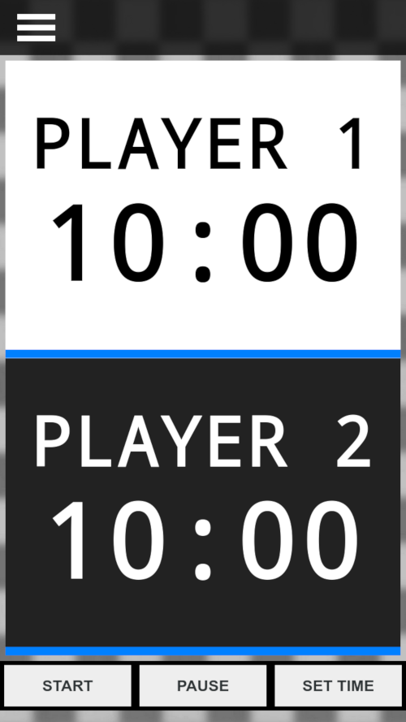

# A mobile first, responsive online chess clock - New and Improved!

# Created using Javascript ES6, Webpack, Babel, HTML5, and CSS3.

# https://chessclock.tk

# Features:

 * Mobile First
 * Responsive Design
 * Javascript ES6
 * Webpack 4
 * Babel
 * HTML5
 * CSS3
 * Sound Effects
 * CSS Sprites
 * A Custom Font

# &#9815; &#9812; &#9823; &#9822; &#9816; &#9818; &#9821; &#9813; &#9819; &#9820; &#9817; &#9814;

# License:

This project is licensed under the GPL-3.0 License.
