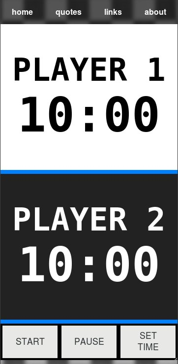

# A mobile first, responsive online chess clock - New and Improved!

## Created using Javascript ES6, HTML5, and CSS3. ##

Website: [https://iambw.github.io/chess_clock/](https://iambw.github.io/chess_clock/)

## Features:
 * Mobile First Design
 * Responsive
 * Javascript ES6
 * HTML5
 * CSS3
 * Sound Effects

&#9812;
  &#9813;
  &#9814;
  &#9815;
  &#9816;
  &#9817;
  &#9818;
  &#9819;
  &#9820;
  &#9821;
  &#9822;
  &#9823;
## License: ##

This project is licensed under the GPL-3.0 License.
